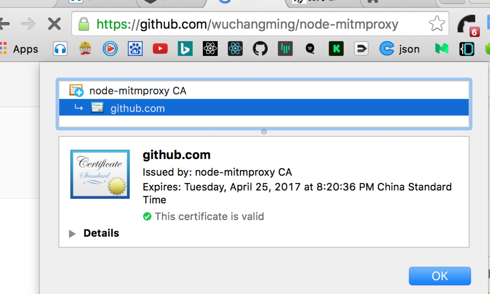

# node-mitmproxy v2.X 开发中
[](https://www.npmjs.com/package/node-mitmproxy)  
基于nodejs 实现的MITM(中间人)代理, 已lib的方式提供其它nodejs项目调用

支持https:  





## 安装

###### windows
```
    npm install node-mitmproxy@next
```
###### Mac
```
    npm install node-mitmproxy@next
```

## 生成CA根证书
```
    var mitmproxy = require('node-mitmproxy');
    mitmproxy.createCA();

```

## 安装CA Root证书
###### Mac
```
sudo security add-trusted-cert -d -r trustRoot -k /Library/Keychains/System.keychain ~/node-mitmproxy/node-mitmproxy.ca.crt
```
###### windows
注: 证书需要安装到  ** 受信任的根证书目录 ** 下  
参考 [issues#3](https://github.com/wuchangming/node-mitmproxy/issues/3)
```
start %HOMEPATH%/node-mitmproxy/node-mitmproxy.ca.crt
```

## 启动代理
```
var mitmproxy = require('node-mitmproxy');

mitmproxy.createProxy({
    sslConnectInterceptor: (req, cltSocket, head) => true,
    requestInterceptor: (rOptions, req, res, ssl, next) => {
        console.log(`正在访问：${rOptions.protocol}//${rOptions.hostname}:${rOptions.port}`);
        console.log('cookie:', rOptions.headers.cookie);
        res.end('Hello node-mitmproxy!');
        next();
    },
    responseInterceptor: (req, res, proxyReq, proxyRes, ssl, next) => {
        next();
    }
});
```


## 关于伪造https证书的逻辑图

