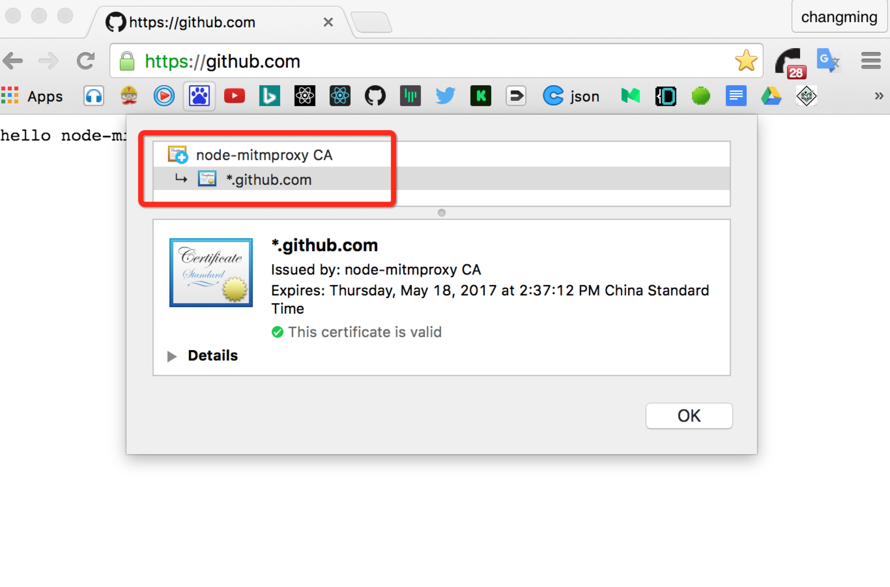

# node-mitmproxy
[](https://www.npmjs.com/package/node-mitmproxy)  
node-mitmproxy是一个基于nodejs，支持http/https的中间人(MITM)代理，便于渗透测试和开发调试。

## 1、特性
1、支持https  
2、支持配置的方式启动，也支持以模块的方式引入到代码中

## 2、安装

###### windows
```
    npm install node-mitmproxy -g
```
###### Mac
```
    sudo npm install node-mitmproxy -g
```

## 3、使用

#### 关于配置文件

###### 简单配置：

simpleConfig.js
```
module.exports = {
    sslConnectInterceptor: (req, cltSocket, head) => true,
    requestInterceptor: (rOptions, req, res, ssl, next) => {
        console.log(`正在访问：${rOptions.protocol}//${rOptions.hostname}:${rOptions.port}`);
        console.log('cookie:', rOptions.headers.cookie);
        res.end('hello node-mitmproxy!');
        next();
    }
};

```
效果图：  


[详细配置说明](https://github.com/wuchangming/node-mitmproxy#4配置详细说明)  
[更多例子](./example/config/)
#### 启动方式
```
node-mitmproxy -c simpleConfig.js
```

### 安装node-mitmproxy CA根证书
生成CA根证书的默认路径：`%用户名%/node-mitmproxy`

#### PC下安装根证书方式
###### Mac
```
sudo security add-trusted-cert -d -r trustRoot -k /Library/Keychains/System.keychain ~/node-mitmproxy/node-mitmproxy.ca.crt
```
###### windows
注: 证书需要安装到  ** 受信任的根证书目录 ** 下  
参考 [issues#3](https://github.com/wuchangming/node-mitmproxy/issues/3)
```
start %HOMEPATH%/node-mitmproxy/node-mitmproxy.ca.crt
```

## 以nodejs模块的方式引用到代码中
```
var mitmproxy = require('node-mitmproxy');

mitmproxy.createProxy({
    sslConnectInterceptor: (req, cltSocket, head) => true,
    requestInterceptor: (rOptions, req, res, ssl, next) => {
        console.log(`正在访问：${rOptions.protocol}//${rOptions.hostname}:${rOptions.port}`);
        console.log('cookie:', rOptions.headers.cookie);
        res.end('Hello node-mitmproxy!');
        next();
    },
    responseInterceptor: (req, res, proxyReq, proxyRes, ssl, next) => {
        next();
    }
});
```


## 4、配置详细说明

#### port
启动端口（默认：6789）
```
    port: 6789
```

#### sslConnectInterceptor
判断该connnect请求是否需要代理，传入参数参考[http connnect](https://nodejs.org/api/http.html#http_event_connect) 。
```
    sslConnectInterceptor: (clientReq, clientSocket, head) => true,
```

#### requestInterceptor
拦截客户端请求/响应

参数说明：
1、requestOptions：客户端请求参数  
2、clientReq: 客户端请求，参考[http.IncomingMessage](https://nodejs.org/api/http.html#http_class_http_incomingmessage)  
3、clientRes: 客户端响应，参考[http.ServerResponse](https://nodejs.org/api/http.html#http_class_http_serverresponse)  
4、ssl: 该请求是否为https  
5、next: 回调函数，执行完拦截逻辑后调用该方法  
```
    requestInterceptor: (requestOptions, clientReq, clientRes, ssl, next) => {
        next();
    }
```
#### responseInterceptor
拦截服务端请求/响应
参数说明：

1、clientReq: 客户端请求，参考[http.IncomingMessage](https://nodejs.org/api/http.html#http_class_http_incomingmessage)  
2、clientRes: 客户端响应，参考[http.ServerResponse](https://nodejs.org/api/http.html#http_class_http_serverresponse)  
3、proxyRes: 服务端请求，参考[http.IncomingMessage](https://nodejs.org/api/http.html#http_class_http_incomingmessage)  
4、proxyRes: 服务端响应，参考[http.ServerResponse](https://nodejs.org/api/http.html#http_class_http_serverresponse)  
5、ssl: 该请求是否为https  
6、next: 回调函数，执行完拦截逻辑后调用该方法  
```
    responseInterceptor: (clientReq, clientRes, proxyRes, proxyRes, ssl, next) => {
        next();
    }
```
#### caCertPath
CA根证书路径(ps: 无特殊情况无需配置)  
默认：%HOMEPATH%/node-mitmproxy/node-mitmproxy.ca.crt  
```
caCertPath: 'xxxx/xxxx.crt'
```

#### caKeyPath
CA根证书密钥路径(ps: 无特殊情况无需配置)  
默认：%HOMEPATH%/node-mitmproxy/node-mitmproxy.ca.key.pem  
```
caKeyPath: 'xxxx/xxxx.pem'
```

## 5、更多
#### 关于伪造https证书的逻辑图

